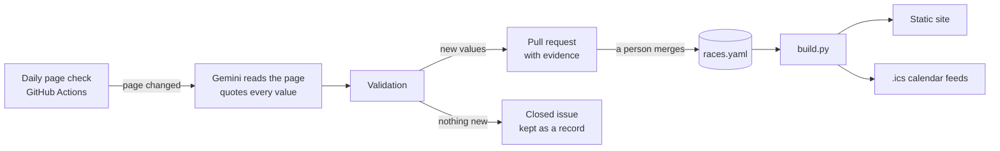

# UK Race & Ballot Tracker

A free, self-updating tracker of major UK running races and their ballot windows, with calendar feeds that remind runners before ballots open and close. Built for a running club whose race news was scattered across WhatsApp posts, so people kept missing ballots.

**Live site:** https://ukracetracker.github.io/uk-race-tracker/


> Always confirm dates on the official site. Not affiliated with any race.

## What it does

- **One list of races**: 17 major races so far (UK marathons, halves and 10Ks, plus Paris, Berlin Half and Milan), with race dates, ballot windows, entry status and a link to each official page.
- **Upcoming deadlines**: ballots opening or closing in the next 30 days, with a countdown.
- **Calendar reminders**: subscribe once in Google, Apple or Outlook calendar (`all`, `marathons`, `halves` or `ballots-only`). Each ballot creates "Ballot opens", "Ballot closes in 2 days" and "Ballot closes today" events, and changed dates update in subscribers' calendars automatically.
- **Keeps itself up to date**: every morning a bot checks the official pages of races whose sites allow automated checks. When one changes, an LLM reads it and opens a pull request with the proposed update and the exact sentence each value came from. A person reviews and merges it. Races whose sites don't allow it are checked by hand.
- **Shows how fresh each entry is**: "verified 2 Oct · page unchanged, checked 3 Oct", or "page changed: being reviewed" until someone confirms the new details.
- **£0 to run**: GitHub Actions, GitHub Pages and a free LLM tier. No server, no database, no accounts, no personal data.

## How it works



The whole system is one GitHub repo. A YAML file is the database, GitHub Actions does the work, pull requests are the review queue and GitHub Pages serves the result. Nothing reaches the live site without a person approving it.

**The daily check** (`check_pages.py`):

1. **Fetch** the official page (and source page, if different) of each race set to `monitoring: auto`, which is only used where the site's terms allow automated checks. The bot identifies itself, honours robots.txt and waits between requests to the same site.
2. **Clean** it down to visible text, dropping scripts, menus, footers and forms, so the text only changes when the content does.
3. **Compare** it with yesterday's snapshot. Most days nothing changes and the run stops there.
4. **Extract**: for a changed page, Gemini gets all of that race's pages and returns the race date, ballot dates, results date, entry date, price and status as JSON, quoting the sentence each value came from.
5. **Validate**: every quote must actually appear on the page, race dates must belong to the right year, and the updated record must pass the same checks as hand-entered data (a ballot can't close before it opens, and so on). Anything that fails is dropped and listed for a person.
6. **Propose**: a pull request edits only that race's lines in `races.yaml` and shows the old value, new value and evidence for each field. Merging it rebuilds the site and calendar feeds. If the race's details didn't change (a new menu button, say), the bot files an already-closed issue as a record instead, so noise needs no attention; if the LLM couldn't run or found something it won't fill in itself, the issue stays open for a person.

If a page fails to load for 7 days in a row (some sites block cloud servers), the bot opens an issue suggesting the race be checked by hand, and closes it if the page comes back. Pages that stop being watched have their saved copy deleted.

## Measuring the LLM

`evaluate_extraction.py` runs extraction against every automatically checked race whose details were verified by hand, and scores each field. It runs in CI whenever the prompt or model changes.

Latest run (7 races, `gemini-3.5-flash-lite`):

- **Known values: 16 of 16 correct**, including every race date and every status.
- **No invented values got through.** Every quote is checked against the page; in earlier runs, an answer that paraphrased instead of quoting was rejected, as designed.
- It also found four real facts the hand-entered data didn't have yet (Berlin's lottery window and Kew's entry opening dates). They came without times, so they're listed for a person instead of being added automatically.
- Earlier, wider runs scored 84–88%: the misses were status labels (e.g. "sold out" vs "ballot closed"), which show up immediately in review next to the quoted evidence, and a prompt fix for festival weekends that turned a wrong race date into a right one.

## Design decisions and lessons

- **Not blocked isn't the same as allowed.** The bot originally checked robots.txt and whether a site let it in, and treated that as permission. A site's terms of use are a separate legal document: London Marathon Events' robots.txt allows its race pages, but its terms forbid bots and using its content with AI. Those four races are now checked by hand, their saved page copies were deleted, and every race's terms are read before it's set to automatic checks.
- **Evidence or nothing.** The LLM must quote the page for every value, and code checks the quote exists. That turns "trust the model" into "check one sentence", which takes seconds.
- **Keep all visible text, not "main content".** `trafilatura` was the first choice for cleaning pages, but it threw away banner text, which is exactly where some races put their date (Bath Half). Keeping all visible text minus scripts, menus and footers was more reliable.
- **Don't republish other sites' content.** Page snapshots are needed to show diffs, but they live in the GitHub Actions cache rather than this public repo. Only facts (dates, prices) and links are stored.
- **Reminders are events, not alarms.** Google Calendar ignores alarms in subscribed feeds, so "closes in 2 days" is its own event. Stable event IDs mean a corrected date moves the existing event instead of duplicating it.
- **Choose the free model by its quota.** The newest Gemini Flash models allowed about 20 free requests a day and were often overloaded. Flash-Lite allows 500, scored well on the evaluation, and is the default. The provider sits behind one small client, so it can be swapped.
- **Small edits, not re-dumped YAML.** The bot changes only the affected lines of `races.yaml`, keeping comments and making review diffs tiny.
- **Two kinds of "fresh".** `last_verified` only changes when a person confirms details. The site adds what the daily check knows, so stale data never looks fresh and fresh data doesn't look stale.

## Tech stack

| Area | Tools |
| --- | --- |
| Data and validation | YAML, Pydantic, generated JSON Schema |
| Fetching and cleaning | `httpx`, `lxml`, `urllib.robotparser` |
| LLM extraction | Google Gemini API (`generateContent` with a response schema), free tier |
| Site and feeds | Jinja2, vanilla JS, `icalendar` |
| Automation | GitHub Actions (daily check, build, evaluation), GitHub Pages |
| Analytics | GoatCounter (no cookies, no personal data) |
| Tests | pytest, with the network and LLM faked; no test touches a real site or API |

## Running it locally

Requires Python 3.11+.

```bash
py -m venv .venv
.venv\Scripts\activate          # macOS/Linux: source .venv/bin/activate
pip install -r requirements.txt
python -m pytest                # run the tests
python build.py                 # validate races.yaml and build site/ and the .ics feeds
python -m http.server 8000 --directory site    # preview at http://localhost:8000
python check_pages.py           # check the race pages and print what changed
```

| Path | What it is |
| --- | --- |
| `races.yaml` | The data: one record per race edition |
| `build.py` | Validates the data and builds the site and calendar feeds |
| `check_pages.py` | The daily page check, LLM proposals and alerts |
| `evaluate_extraction.py` | Scores LLM extraction against hand-verified races |
| `tracker/` | Models, fetching, cleaning, extraction, GitHub integration |
| `templates/` | The site template |
| `schema/races.schema.json` | JSON Schema generated from the model (`python build.py --write-schema`) |

**Configuration** (repo secrets and variables, all optional):

| Name | Purpose |
| --- | --- |
| `GEMINI_API_KEY` (secret) | Turns on LLM extraction and pull requests; without it, changes are reported as issues |
| `GEMINI_MODEL` | Overrides the default model (`gemini-3.5-flash-lite`) |
| `GOATCOUNTER_URL` | Turns on visit counting |

To try the pull-request flow without waiting for a real change, run the **Check race pages** workflow by hand with a race id in *propose for*.

## Data model

Each race edition is one record in `races.yaml` (`london-marathon-2027`), so past years stay as history.

| Field | Example | Notes |
| --- | --- | --- |
| `id` | `london-marathon-2027` | slug + year |
| `name`, `distance`, `location`, `country` | London Marathon, marathon, London, UK | `distance`: marathon / half / 10k / ultra / other |
| `race_date`, `race_date_end` | 2027-04-24, 2027-04-25 | end date only for multi-day races |
| `entry_type` | [ballot, charity, gfa] | ballot / general / charity / gfa |
| `ballot_opens`, `ballot_closes` | 2026-04-27T10:00 | UK local time |
| `ballot_results`, `general_entry_opens`, `price_gbp` | 2026-07-01 | optional |
| `official_url`, `source_url` | | pages that are checked daily |
| `status` | ballot_open | unannounced / announced / ballot_open / ballot_closed / sold_out / done |
| `confidence` | confirmed | confirmed / expected / estimated; only confirmed dates go into calendars |
| `last_verified` | 2026-10-02 | when a person last confirmed the details |
| `monitoring` | auto | `auto` only where the site's terms allow automated checks; otherwise `manual` |
| `notes` | | short and plain |

## Respecting race websites

- Automated checks only run where a site's **terms of use** allow them; otherwise the race is `manual` and checked by hand. Aggregators, which usually forbid scraping, are never used.
- Where checks run: one request per page per day, robots.txt respected, and a user agent that names the bot and links here.
- Only facts and links are stored; no race descriptions, logos or photos. Page snapshots used to spot changes are kept privately and deleted when a page stops being watched.

## Roadmap

- Pick individual races for your calendar, not just groups
- A ready-to-paste weekly WhatsApp digest of upcoming ballots
- A suggestion form for runners without GitHub accounts
- More races, as the club asks for them

## Licence

[MIT](LICENSE)
